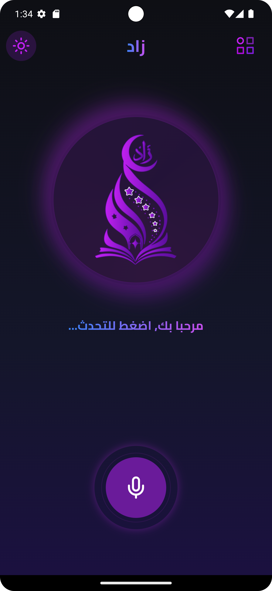
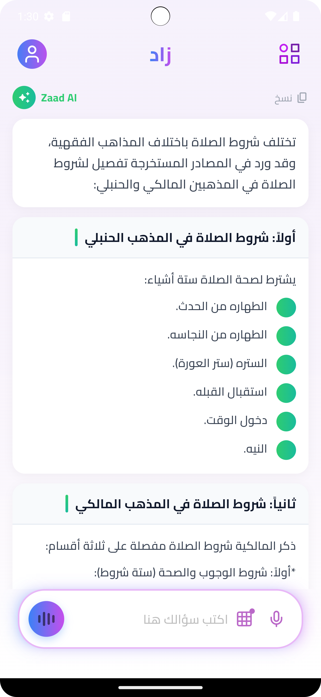
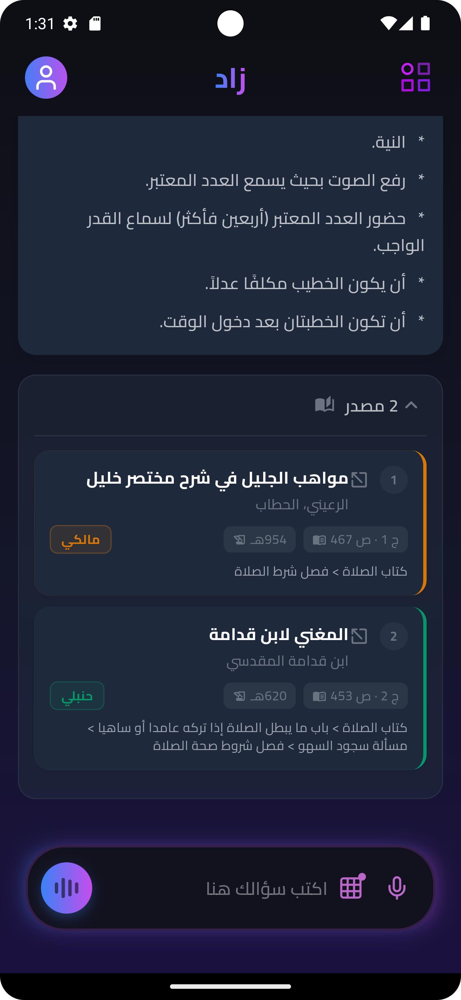
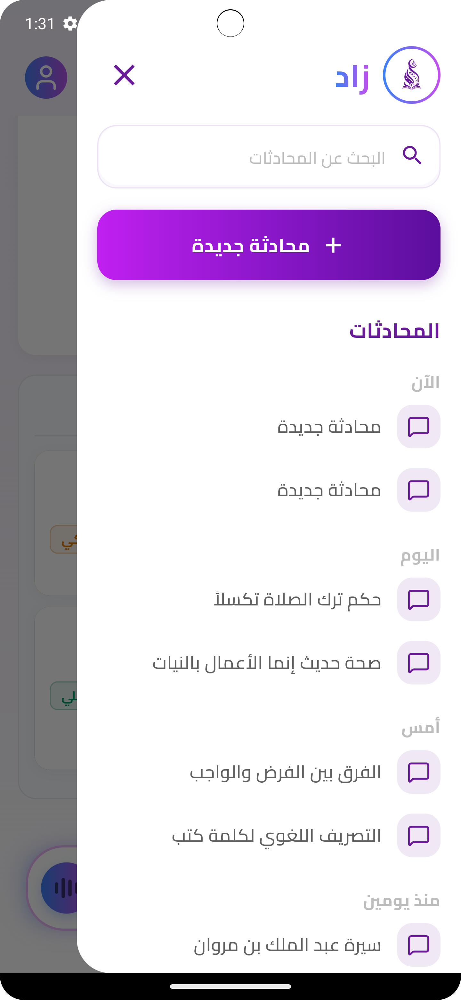

# Zaad Mobile App

The official Flutter application for **Zaad**, an AI-powered Islamic assistant designed to provide a modern and intuitive experience for interacting with Islamic knowledge.

The mobile app offers text and voice conversations with the AI assistant through a clean, responsive, and user-friendly interface.

---

## Features

- Modern and intuitive UI
- AI-powered chat experience
- Voice conversations
- Speech-to-Text support
- Responsive design
- Dark & Light theme support
- Secure authentication
- Smooth animations

---

## Screenshots

<div align="center">
  
  
  
  
</div>

---

# Tech Stack

### Framework

- Flutter
- Dart

### State Management

- Bloc / Cubit
- Provider

### Networking

- Dio
- Retrofit

### Dependency Injection

- GetIt
- Injectable

### Voice

- LiveKit
- Speech-to-Text

### Local Storage

- Shared Preferences

### UI

- Flutter ScreenUtil
- Flutter Animate
- Siri Wave

---

# Project Structure

```
lib/
├── core/
├── features/
│   ├── auth/
│   ├── chatbot/
│   ├── onboarding/
│   └── settings/
├── shared/
└── main.dart
```

---

# Getting Started

## Prerequisites

- Flutter SDK
- Dart SDK

## Installation

```bash
git clone <repository-url>

cd mobile

flutter pub get

flutter run
```

---

# Architecture

The project follows **Clean Architecture** with a feature-based structure.

- Core layer for shared utilities.
- Feature modules for better scalability.
- Separation between UI, business logic, and data layers.
- Dependency Injection using GetIt & Injectable.

---

# License

Apache License 2.0
